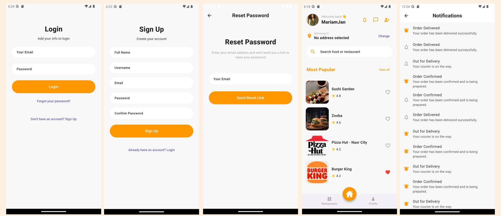
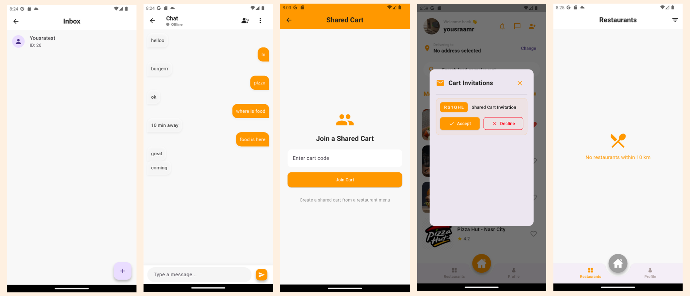
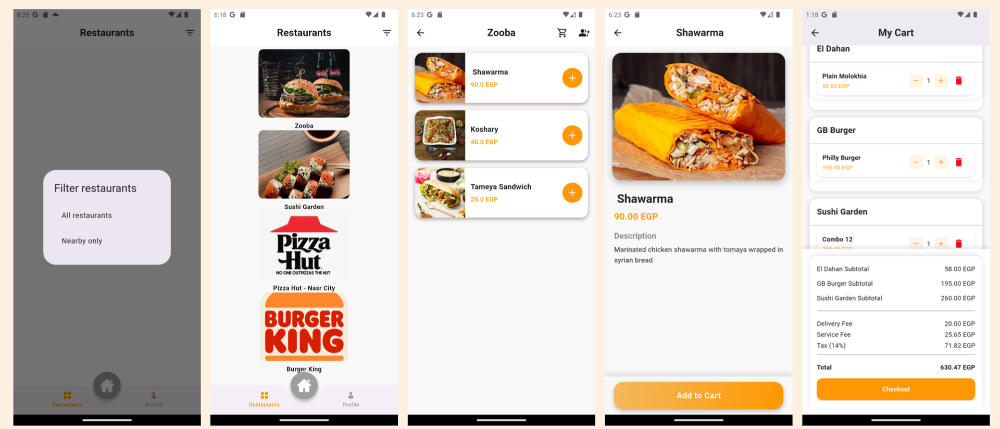
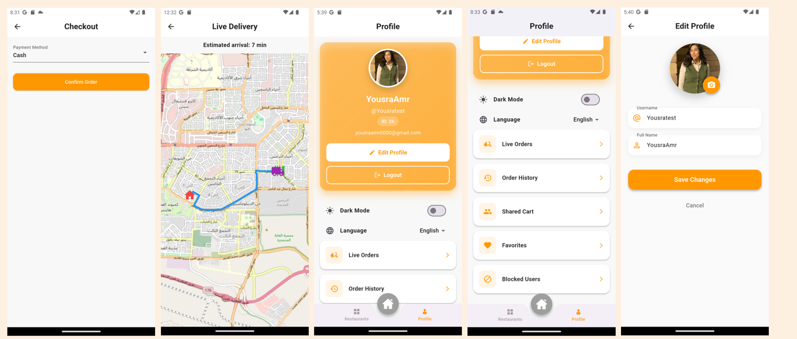
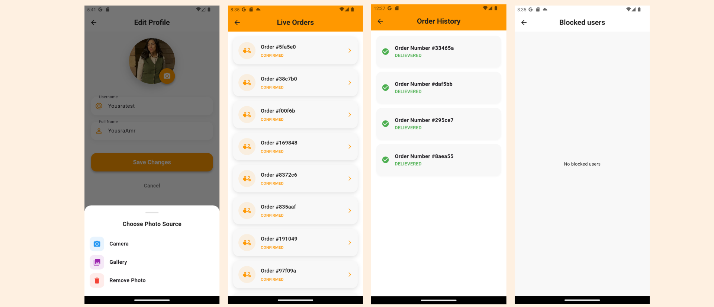
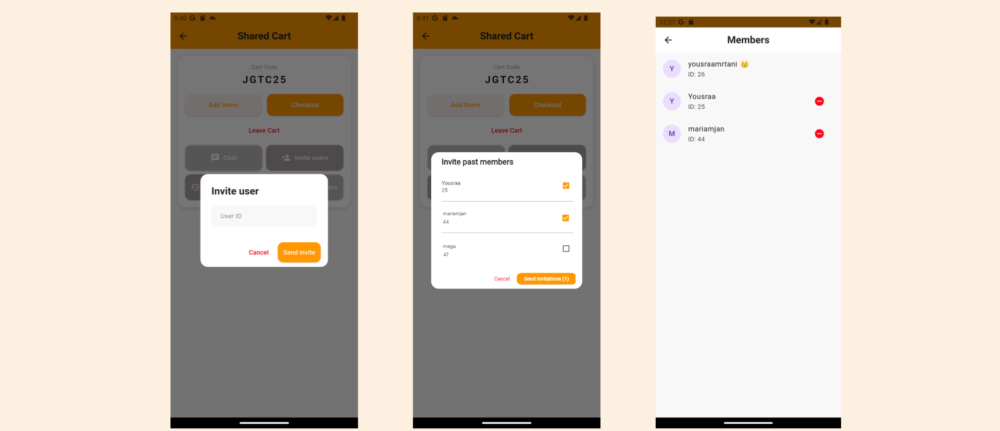

# 🛒 Eatify App

A **modern Flutter mobile food-ordering application** that brings the restaurant experience to your fingertips. Eatify allows users to browse restaurants, customize meals, place orders, and track deliveries in real time.  

Its standout feature is a **shared-cart system**, enabling friends to collaborate on a single order while keeping each person’s contribution separate, ensuring a smooth social ordering experience.  

Unlike conventional food-ordering apps, Eatify’s **personal cart** lets users combine items from different restaurants into a single order. This feature ensures one seamless checkout, unified delivery, and simplifies tracking for users , also provides chat functionality, live updates for orders and deliveries, and advanced features like OSRM routing for optimal delivery paths.

---

## 🚀 Features

### 🍔 Core Features
- Browse Restaurants & Menus with images, prices, and descriptions  
- **Personal Cart**: add items from multiple restaurants  
- Secure Checkout and Payment   
- Live Delivery Tracking with maps and estimated arrival times  
- Order History for all past orders  

### 🛒 Shared Cart System
- Invite friends via **User ID**, **Generated Code**, or **Past Members**  
- **Group Chat** with typing indicators and read receipts  
- Manage participants: add, or remove users  
- Automatic **bill splitting** showing each person’s contribution  

### 💬 Chat & Social Features
- Personal Chat with users, including block functionality  
- Group Chat with typing indicators and read receipts  
- Media sharing via **Camera / Gallery**  

### 🎨 Personalization
- Favorites per user  
- **Theme Mode**: Dark & Light   
- **Localization**: English 🇺🇸 and Arabic 🇸🇦 using `easy_localization`  

### 📍 Location & Maps
- Location Services and permissions handling  
- Google Maps Integration for live delivery tracking  
- OSRM integration for optimized routing  

### ⚡ Advanced UX
- Smooth animations across the app  
- Dismissible actions, sorting, undo/delete functionality  
- Orientation holding for consistent layout  
- Live updates for orders and deliveries  

---

## 🏗️ Architecture

Eatify uses a **modular Clean Architecture** with feature-based separation:

- **Presentation Layer**: UI screens, widgets, and Riverpod providers  
- **Domain / Models Layer**: Core data models (`User`, `Order`, `Cart`)  
- **Data / Services Layer**: Supabase API integration, location & media services  
- **Core / Utilities Layer**: Common helpers, theme management, translations  

**State Management**:  
- Flutter Riverpod, with `StateNotifier` and `FutureProvider` for reactive UI updates  

**Backend**:  
- Supabase for authentication, database, and storage  
- Services abstract data access from UI and providers  

> Principles: separation of concerns, modularity, scalability, reactivity, and clean code practices.

---

## 📱 Screenshots

 |  |
 |  |
 |  |
 |  |

---

## 🛠️ Technologies & Packages Used

| Purpose                   | Package Name |
|----------------------------|--------------|
| State Management           | [`flutter_riverpod`](https://pub.dev/packages/flutter_riverpod) |
| Backend Integration        | [`supabase_flutter`](https://pub.dev/packages/supabase_flutter) |
| Localization               | [`easy_localization`](https://pub.dev/packages/easy_localization) |
| Image Handling             | [`cached_network_image`](https://pub.dev/packages/cached_network_image), [`image_picker`](https://pub.dev/packages/image_picker) |
| Maps & Location Services   | [`google_maps_flutter`](https://pub.dev/packages/google_maps_flutter), [`geolocator`](https://pub.dev/packages/geolocator) |
| Permissions                | [`permission_handler`](https://pub.dev/packages/permission_handler) |
| Utilities                  | [`uuid`](https://pub.dev/packages/uuid), [`intl`](https://pub.dev/packages/intl) |
| Routing & Mapping          | [`flutter_map`](https://pub.dev/packages/flutter_map), [`latlong2`](https://pub.dev/packages/latlong2) |

---

## 🌐 Localization

Supported languages:  
- English 🇺🇸 (default)  
- Arabic 🇸🇦 
---

## 🎨 Theme Modes

- Light Mode  
- Dark Mode  
---

## 🧪 Getting Started

### 1. Clone the Repository
```bash
git clone https://github.com/yousraamr/Eatify.git
cd Eatify
```
---

## Contact Us

Need help or have a question? Feel free to reach out to us!

[](https://github.com/yousraamr)
[](https://github.com/MariamJan)  
[](https://github.com/iYaktina) 
[](https://github.com/samahegazy22)  
[](https://github.com/RahmaWael00)  
